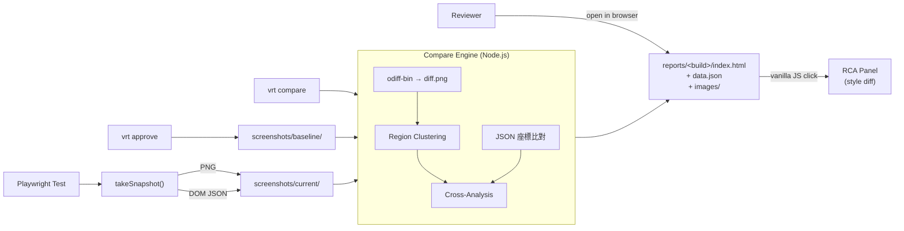

## 整合來源與決策

- **原 4 週 Roadmap** (你最初提供的文件): 提供長期願景；Rust 核心、Docker、Redis 全延後
- **Gemini 3 天版**: 採用其無 DB、靜態報告、odiff、噪音過濾的精神
- **保留我原 plan 兩個核心**: (1) computedStyle 白名單 diff (2) 點擊 diff 區塊展開 RCA 面板 — 對齊你示意圖
- **2 天壓縮取捨**: 砍掉 GitHub Action、Diff Slider、多 snapshot sidebar 切換；保留所有核心採集/比對/報告邏輯
- **三方折衷**: 靜態 HTML + 內嵌 JSON + Vanilla JS，無 web server 但有 Percy-like 互動

## 範圍對照

| 面向 | 原 Roadmap | POC (2 天) | 備註 |
|---|---|---|---|
| 影像比對 | 自製 Rust crate | `odiff-bin` (Rust 二進位 npm 包) | Rust 效能、零實作成本 |
| API Gateway | Rust/Axum | **無** — 純 CLI + 檔案系統 | 砍掉最大複雜度 |
| 任務隊列 | Redis + Worker | 同步處理 | POC 一次跑一個 build |
| 後端渲染 | Docker headless | SDK 端截圖直接存檔 | 簡化最關鍵環節 |
| 資料庫 | PostgreSQL | **無** — 檔案系統 | Gemini 建議 |
| Asset CAS | SHA-256 + WebP | 檔名 = `<name>-<viewport>.png` | 維持可重現性即可 |
| Dashboard | React | **靜態 HTML + Vanilla JS** | 無 server 但保留互動 |
| Approval | UI 按鈕 | `vrt approve` CLI | 等價、零依賴 |
| CI/CD | GitHub Action | **延後** | 兩天版本砍掉 |
| 噪音過濾 | — | `excludeSelectors` 雙重保險 | Gemini 提到的動態元件 |
| 交叉定位 | — | image regions ∩ DOM rects → selector | POC 核心差異化 |

## 系統架構



## 專案結構

```
visual-regression-poc/
├── package.json
├── vrt.config.ts              # viewports, excludeSelectors, computedStyleProps
├── src/
│   ├── cli.ts                 # vrt capture | compare | approve
│   ├── sdk/
│   │   ├── index.ts           # takeSnapshot(page, name)
│   │   └── serializeDom.ts    # 注入瀏覽器的腳本
│   ├── engine/
│   │   ├── imageDiff.ts       # 呼叫 odiff-bin
│   │   ├── regionCluster.ts   # 像素 → 矩形區塊
│   │   ├── coordDiff.ts       # JSON 對齊比對
│   │   └── crossAnalysis.ts   # 交叉定位 + style diff
│   └── report/
│       ├── generate.ts        # 把資料烤成 HTML
│       └── template/
│           ├── index.html
│           ├── viewer.js      # Vanilla JS 互動
│           └── viewer.css
├── demo/
│   ├── v1/index.html
│   ├── v2/index.html
│   └── snapshot.spec.ts
├── screenshots/
│   ├── baseline/{home-1280x720.png, home-1280x720.json}
│   └── current/{...}
└── reports/
    └── 2026-05-03T17-30-00/{index.html, data.json, images/}
```

---

## Day 1 (~12h): 採集 + 引擎

### Block A — Scaffold (2h)
- `pnpm init` + 安裝：`typescript tsx commander @playwright/test odiff-bin pngjs`
- `tsconfig.json` (strict, ESNext, NodeNext)
- 目錄骨架、`vrt.config.ts` 範本、`package.json` bin 指向 `src/cli.ts`

### Block B — SDK takeSnapshot (3h) — [src/sdk/index.ts](src/sdk/index.ts)

```ts
export async function takeSnapshot(page: Page, name: string): Promise<void> {
  const config = await loadConfig();
  const target = process.env.VRT_TARGET ?? 'current';
  for (const vp of config.viewports) {
    await page.setViewportSize(vp);
    await page.addStyleTag({ content: hideSelectorsCSS(config.excludeSelectors) });
    const png = await page.screenshot({ fullPage: false }); // 固定 viewport，避免座標漂移
    const dom = await page.evaluate(serializeDom, {
      excludeSelectors: config.excludeSelectors,
      computedStyleProps: config.computedStyleProps,
    });
    const key = `${name}-${vp.width}x${vp.height}`;
    await fs.writeFile(`screenshots/${target}/${key}.png`, png);
    await fs.writeFile(`screenshots/${target}/${key}.json`, JSON.stringify({
      name, viewport: vp, devicePixelRatio: dom.dpr, elements: dom.elements
    }, null, 2));
  }
}
```

**ElementSnapshot type** ([src/sdk/serializeDom.ts](src/sdk/serializeDom.ts)):
```ts
type ElementSnapshot = {
  xpath: string;                          // 跨 build 配對 key
  cssSelector: string;                    // 給人類看
  tag: string;
  rect: { x: number; y: number; w: number; h: number };
  computedStyle: Record<string, string>;  // 白名單
  depth: number;                          // hit-test 用
};
```
- 從 `document.body` 遍歷，跳過 `<script>/<style>/<link>` 與 `excludeSelectors`
- 跳過 `rect.w * rect.h < 16` 的元素
- `computedStyle` 白名單：`backgroundColor, color, fontSize, fontFamily, fontWeight, padding, margin, border, display, position, width, height, opacity, transform, boxShadow, borderRadius`

### Block C — Demo + capture CLI (2h)

- `demo/v1/index.html`: 紫色背景 + 藍色 CTA + 三張白色卡片 (對齊你示意圖 baseline)
- `demo/v2/index.html`: 粉色背景 + 紅色 CTA (對齊 changes)
- `demo/snapshot.spec.ts`: Playwright 開 `file://demo/${VRT_DEMO_VERSION}/index.html`，呼叫 `takeSnapshot(page, 'home')`
- CLI: `vrt capture --target baseline` 設環境變數後執行 `playwright test`

### Block D — odiff + 區塊聚類 (2h) — [src/engine/imageDiff.ts](src/engine/imageDiff.ts), [src/engine/regionCluster.ts](src/engine/regionCluster.ts)

```ts
import { compare } from 'odiff-bin';
const r = await compare(baselinePath, currentPath, outDiffPath, {
  threshold: 0.1, antialiasing: true, outputDiffMask: true
});
```
- 讀回 diffMask PNG → BFS 連通分量 (4-connectivity) → bounding boxes
- 過濾 `w < 4 || h < 4` 雜訊
- 輸出按 `pixelCount desc` 排序的 `Region[]`

### Block E — coordDiff + crossAnalysis (3h) — POC 的技術核心

[src/engine/coordDiff.ts](src/engine/coordDiff.ts):
```ts
type ElementChange =
  | { kind: 'shifted'; xpath: string; before: Rect; after: Rect; deltaXY: [number, number] }
  | { kind: 'resized'; xpath: string; before: Rect; after: Rect }
  | { kind: 'styled'; xpath: string; styleDiff: { prop: string; before: string; after: string }[] }
  | { kind: 'deleted'; xpath: string; before: Rect }
  | { kind: 'new'; xpath: string; after: Rect };
```

[src/engine/crossAnalysis.ts](src/engine/crossAnalysis.ts):
```ts
type RegionAnalysis = {
  region: Region;                    // 像素差異框
  primarySuspect: {                  // 最可能的元件
    xpath: string;
    cssSelector: string;
    rect: Rect;
    change?: ElementChange;          // 可能是 visual-only (父層 bg 影響)
  };
  candidates: ElementSnapshot[];     // 其他重疊元件 (depth 排序)
};
```
演算法：對每個 `region`，找 `currentDom` 中 IoU > 0.1 的元素 → 按 `depth desc` 排序 → 最深者為 `primarySuspect` → 從 `changes` 找對應 xpath 附上 → 全部寫入 `reports/<ts>/data.json`。

CLI: `vrt compare` 一次跑完整套，產出 `reports/<timestamp>/{index.html, data.json, images/}`。

---

## Day 2 (~10h): 報告 + Approve

### Block A — 報告骨架 (2h) — [src/report/template/index.html](src/report/template/index.html)

布局對齊你 Percy 示意圖：

```
┌────────────────────────────────────────────────────────────┐
│ home  •  1280×720  •  6.89% diff   [Approve] [Reject]      │
├────────────────────────────────────────────────────────────┤
│  ┌──────────────┐    ┌──────────────┐                      │
│  │  Baseline    │    │  Current     │ ← 紅框 overlay 可點   │
│  │              │    │              │                      │
│  └──────────────┘    └──────────────┘                      │
├────────────────────────────────────────────────────────────┤
│ Root Cause Analysis  •  1/3 diffs   [<] [>]                │
│ HTML:    html > body > div.hero       [Copy Xpath]         │
│ Styles:  - backgroundColor: rgb(245,247,250);              │
│          + backgroundColor: rgb(253,246,238);              │
│ Box Model: x=0 y=0  w=1280 h=720                           │
└────────────────────────────────────────────────────────────┘
```

技術選型：
- 純 HTML/CSS/JS、無 build step、Tailwind 用 CDN (`<script src="https://cdn.tailwindcss.com">`)
- `<script id="data" type="application/json">` 內嵌完整 `data.json`
- 報告 generator 用 string template (不引入任何模板引擎，避免 build 步驟)

### Block B — Vanilla JS 互動 (3h) — [src/report/template/viewer.js](src/report/template/viewer.js)

職責：
- 啟動時讀 `<script id="data">` 解析 → 在 current 圖上 overlay 紅框 (絕對定位 div，從 `regions` 渲染)
- 每個紅框綁 `click` → 取對應 `RegionAnalysis` → 更新底部 RCA 面板
- RCA 面板三欄：
  - **HTML**: `cssSelector` + Copy Xpath 按鈕 (`navigator.clipboard.writeText(xpath)`)
  - **Styles**: 從 `change.styleDiff` 渲染紅綠 diff 行 (CSS 用 `bg-red-50 text-red-800` / `bg-green-50 text-green-800`)
  - **Box Model**: position + size，dim 顯示「→ 變更後」如有變
- 鍵盤導航 `<` `>` 切 region；hover 紅框時對應紅框加 outline

DPR 處理：將 region 座標 / `dpr`，再用 `current 圖的渲染寬度 / current 圖的實際像素寬度` 做縮放。

### Block C — Approve CLI (1h) — [src/cli.ts](src/cli.ts)

```bash
vrt approve              # 全部 current/* 覆蓋 baseline/*
vrt approve home         # 只 approve 名為 home 的 snapshot
```
實作：列出將被覆蓋的檔案 → 按 Y 確認 → `fs.copy()` → 印出結果。

### Block D — 報告打磨 (2h)

- 頂部 banner: build 時間、整體 diff %、變更區塊數
- 區塊編號 (`#1`, `#2`) 顯示在紅框右上角，RCA 面板顯示 `1/N`
- `vrt compare --open` 用 `open` (mac) / `xdg-open` (linux) 自動開報告
- 視覺收斂：Tailwind 類風格對齊 Percy 示意圖 (淺灰背景、紅色強調色)

### Block E — README + 煙霧測試 (2h)

`README.md` 三步驟：
```bash
pnpm install
pnpm exec playwright install chromium
VRT_DEMO_VERSION=v1 pnpm vrt capture --target baseline
VRT_DEMO_VERSION=v2 pnpm vrt capture --target current
pnpm vrt compare --open
```
端到端跑一次，確認：截圖正確 → diff 產出 → 紅框定位正確 → 點擊出現正確 style diff → approve 成功。

---

## 明確不做 (POC 範圍外，延後)

- GitHub Action 整合
- Diff Slider (左右拖曳對比)
- 多 snapshot sidebar 切換 (demo 只用一個 snapshot)
- 多瀏覽器 / 多裝置矩陣
- 字體一致性 / Docker 化
- React/Vue 元件層級 source map 對應
- WebP 壓縮 / 真正 CAS 去重
- 多人協作 / 評論 / 認證

---

## 風險與緩解

- **odiff-bin 跨平台**: 已支援 mac/linux/win，`postinstall` 自動下載對應 binary
- **Viewport 不固定 → 座標飄移**: SDK 強制 `setViewportSize` + 非 `fullPage` 截圖，檔名含 viewport
- **xpath 對齊在 DOM 大改時失效**: POC 接受此限制，落入 deleted/new；後續可用 perceptual fingerprint 升級
- **動態元件干擾**: `excludeSelectors` 雙重保險 (序列化跳過 + 截圖前 `visibility: hidden`)
- **DPR 座標換算**: SDK 寫入 `devicePixelRatio`，crossAnalysis 把 region 座標除以 dpr
- **Tailwind CDN 在離線環境失效**: 後續可改 inline `<style>` 或下載到 `template/` 目錄；POC 先接受
- **2 天壓力**: Day 1 夜的 crossAnalysis 是關鍵節點，若進度落後可先用簡化版 (region 中心點 hit-test，不算 IoU)，第二天再回頭優化
